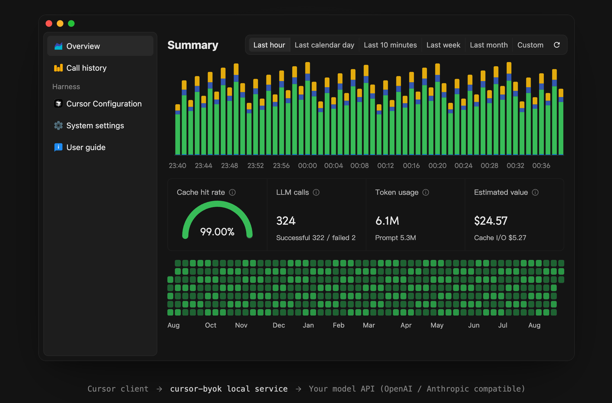

<div align="center">

# haxsd byok

基于 [leookun/cursor-byok](https://github.com/leookun/cursor-byok) 的个人分支，独立产品名为 `haxsd byok`，并额外提供一个可选的本机 Devin 兼容网关。

[English](./README-EN.md) · [分支隔离规则](./BRANCH_ISOLATION.md) · [Devin 集成说明](./docs/devin-integration.md) · [故障排查](./docs/troubleshooting.md) · [上游仓库](https://github.com/leookun/cursor-byok) · [上游文档](https://docs.leokun.cn)

</div>



## 关于这个仓库

> [!CAUTION]
> 本仓库的 `main` 与 `feat/devin-router` 是两条相互隔离的产品线，**禁止合并**。`main` 只维护 Cursor BYOK；当前分支只维护 `haxsd byok` 和 Devin 集成。开发、测试、打包或推送前，请先确认当前分支。完整规则见 [`BRANCH_ISOLATION.md`](./BRANCH_ISOLATION.md)。
>
> 两个产品线在本地是**两个独立克隆**：Devin 线在 `D:\cursor-byok\byok-dev\cursor-byok-devin-router`，Cursor 线在 `D:\cursor-byok\byok-dev\cursor-byok-upstream`。

本仓库是 [leookun/cursor-byok](https://github.com/leookun/cursor-byok) 的 fork，基线为上游 **v1.0.0**（提交 `3725f27`）。上游是 MIT 许可的开源项目，本分支在上游基础上做了以下几处改动，供个人自用：

| 改动 | 说明 |
| --- | --- |
| 移除广告 | 删除桌面端广告位与服务端广告接口，应用不再向广告服务发起请求 |
| 价值估算改为分时计价 | 首页「价值估算」按 DeepSeek-V4.1-Flash 的高峰 / 低谷单价**逐小时**计算 |
| 语言精简 | 界面语言只保留简体中文与英文（移除葡萄牙语） |
| 独立产品身份 | 使用 `haxsd byok` 的独立应用标识、数据目录与安装包；自动更新暂时关闭 |
| Devin 兼容网关 | 额外提供默认关闭的本机 Devin 网关，把 Devin 的模型请求接到已有的模型通道上 |

除此之外，项目的功能、代码结构与上游保持一致，便于后续同步上游改动。

> [!NOTE]
> 上游作者在 `server/src/control/ads.rs` 中注明广告是该开源项目的唯一收入来源，并请求不要在 PR 中移除广告。本仓库是个人分支，改动仅用于自用；如果你喜欢这个项目，请到[上游仓库](https://github.com/leookun/cursor-byok)点个 Star 支持作者。

## 改动详情

### 1. 移除广告

| 位置 | 处理 |
| --- | --- |
| `apps/desktop/src/shell/ads/` | 整个目录删除（广告菜单、浮动广告、缓存与类型定义） |
| `apps/desktop/src/shell/AppLayout.tsx` | 移除广告相关的状态、定时拉取、交互回调与弹窗 |
| `apps/desktop/src/shared/api.ts` | 移除 `/promotions` 与 `/promotions/{id}/dismissals` 两个接口 |
| `server/src/control/ads.rs` | 整个文件删除（广告拉取、图片缓存、免打扰上报） |
| `server/src/control/mod.rs` | 移除三条广告路由 |

菜单里的「使用教程」入口属于功能入口，不属于广告，已保留。

### 2. 「价值估算」改为分时计价

#### 价格表

DeepSeek-V4.1-Flash 官方单价，**两种币种各自一套**（都是官方公布的原价，不是按汇率折算的）：

| 项目 | 人民币 · 低谷 | 人民币 · 高峰 | 美元 · 低谷 | 美元 · 高峰 |
| --- | --- | --- | --- | --- |
| 输入（缓存未命中） | ¥1.00 | ¥2.00 | $0.15 | $0.30 |
| 输入（缓存命中） | ¥0.02 | ¥0.04 | $0.003 | $0.006 |
| 输出 | ¥4.00 | ¥8.00 | $0.60 | $1.20 |
| 缓存写入 | ¥0 | ¥0 | $0 | $0 |

（单位：每百万 token。DeepSeek 不单独收取缓存写入费用。）

**币种跟随界面语言**：简体中文界面用人民币计价，英文界面用美元计价。两种币种在设置里各自维护一套完整价格，切换语言不会互相覆盖。

时段规则：**UTC 周一至周五 01:00–04:00、06:00–10:00 为高峰期**，其余时间（含周末全天）为低谷期，低谷价为高峰价的一半。

#### 为什么按小时算

上游原来的做法是：把所选时间范围内的 token 总数，统一乘以「打开界面那一刻」所属时段的价格。这带来两个问题：

1. 同一个时间范围，在不同时间打开会得到**不同金额**；
2. 只要范围跨过峰谷分界（几乎必然跨过），金额一定是错的。

现在改为向本地服务按**小时**拉取用量分桶，每个小时用它**自己所属时段**的单价计算后求和。之所以精确：DeepSeek 的时段边界都落在整点上，服务端的分桶也严格对齐整点，因此每个分桶完整地属于某个时段，不存在归属误差。

以近 31 天的真实用量为例：逐小时精确计价约 ¥249，而旧算法在低谷期打开只会显示约 ¥162（少算约 ¥88），在高峰期打开则会偏高到约 ¥324。

#### 相关实现

| 文件 | 职责 |
| --- | --- |
| `apps/desktop/src/features/home/metrics/peakOffPeakPricing.ts` | 时段判断、逐小时计价、超长范围分段取数 |
| `apps/desktop/src/features/home/metrics/tokenCost.ts` | 币种规则、价格换算、金额与单价格式化 |
| `apps/desktop/src/features/home/metrics/HomeMetrics.tsx` | 首页「价值估算」卡片与悬浮说明 |
| `apps/desktop/src/features/settings/PricingSettingsCard.tsx` | 「Token 定价」设置卡片，支持两种计价方式 |
| `server/src/store/settings.rs` | 价格设置的持久化结构与默认值 |

设置里的「计价方式」有两种：

- **高峰 / 低谷分别计价**（默认）：填两套单价，按上面的规则逐小时计算；
- **全时段固定单价**：只填一套单价，适用于定价不分时段的模型。

设置卡片里编辑的是**当前界面语言对应币种**的那套价格；要改另一种币种的价格，切换界面语言后再编辑即可。币种与符号的映射集中在 `tokenCost.ts` 的 `currencyOf` 与 `CURRENCY_SYMBOLS` 里。

### 3. 语言

界面语言只保留**简体中文**与**英文**，跟随系统语言时其他语言一律回退到英文。移除了葡萄牙语词条文件与相关判断。

维护翻译的工作流：源码里的中文原文就是词条源文，新增 `t("…")` 调用后执行

```bash
npm --prefix apps/desktop run i18n:scan
```

命令会重建 `apps/desktop/src/i18n/generated/catalog.json`，并把新词条以空值补进各语言文件；随后在 `apps/desktop/src/i18n/locales/en-US.json` 中按 id 填入英文即可（id 是源文的哈希，可在 catalog.json 中按源文检索）。词条占位符必须与源文完全一致，构建时会校验。

### 4. 自动更新

自动更新地址指向本产品自己的仓库（`haxsd/haxsd-byok`），与上游项目的更新通道完全隔离。

> [!IMPORTANT]
> 更新包使用本项目自有的签名密钥。公钥已写入 `apps/desktop/src-tauri/tauri.conf.json` 的 `plugins.updater.pubkey`；对应私钥存放在新仓库的 Actions 机密 `TAURI_SIGNING_PRIVATE_KEY` 中。**私钥一旦丢失就无法再发布可用的更新**，请另行离线备份。

### 5. Devin 兼容网关

默认**关闭**，关闭时不监听任何端口，Cursor 侧行为完全不变。开启后在本机回环地址上多起三个监听：

| 监听 | 默认端口 | 作用 |
| --- | --- | --- |
| API / 目录 | `43110` | Devin 模型目录与 `AssignModel` |
| 推理 | `43111` | Connect 协议的流式模型请求 |
| 本机 API | `43112` | 本机管理接口 |

一次请求的走向：

```text
Devin 客户端
    │ Connect 帧（protobuf 字段 + gzip）
    ▼
Devin 网关（默认关闭，仅 127.0.0.1，24 MiB 上限）
    │ 按 Devin 模型 UID 查绑定 → 选中路由的模型哈希
    ▼
模型通道 / ProviderRouter（与 Cursor 共用，密钥仍只在模型记录里）
    │ 流式事件
    ▼
转回 Connect 帧（文本、thinking、工具调用、用量、结束原因）
```

绑定与路由：每个绑定把一个 Devin 模型 UID 映射到一个已有模型哈希；可选多个候选路由（`routes` + `active_route_id`），切换是手动动作，不会因为保存或刷新目录而改动。标记为 `context_compression` 的绑定是单行绑定，用于上下文压缩，不允许配候选路由。旧版本的设置 JSON 不需要迁移：没有路由字段时继续用原来的 `model_hash`。

明确**不做**的部分：不做官方 Devin 直连路由、不做上游目录拉取、provider 失败后不会自动切到另一个候选路由。这三项都需要真实的 Devin 抓包证据，见 [`docs/devin-integration.md`](./docs/devin-integration.md)。

和厂商版 Devin Model Router 的逐项对照（它在本机真实存在，结构与字段已记录在案）见 [`docs/devin-router-vendor-evidence.md`](./docs/devin-router-vendor-evidence.md)：厂商用「家族（family）」为单位保存选择、把「用户配置的默认」与「当前选中」分开、并给上下文压缩绑定独立的缓存命名空间——这些都值得后续借鉴，而 wire 层的字段形状仍缺真实抓包。

宿主补丁是显式动作：需要用户自己给出 `extension.js` 的绝对路径，校验四个锚点后才写入，写入前生成带 SHA-256 的备份；宿主文件被改过或备份对不上时，「恢复原文件」会拒绝执行。

**从零到用起来**的完整操作序列（装应用 → 配置网关与绑定模型 → 把 Devin 切过来 → 验证 → 回退）见 [`docs/devin-go-live.md`](./docs/devin-go-live.md)。其中"交换宿主文件"的原因值得先读：Devin 的端点写在它自己的 `extension.js` 里，若已被别的路由器改过，本项目补丁会 fail-closed 拒绝，必须先还原干净版本再打补丁。

## 构建与验证

依赖：Node.js 22、Rust stable、Tauri 的系统依赖（Windows 下为 WebView2 与 MSVC 工具链）。
```bash
# 前端：类型检查 + 生产构建
npm --prefix apps/desktop run check

# 后端：格式、静态检查、测试
cargo fmt --all -- --check
cargo clippy --workspace --all-targets -- -D warnings
cargo test --workspace --all-targets

# 桌面端打包
make build-desktop
```

本分支的改动已通过以下验证：

- `npm run check`：TypeScript 类型检查与生产构建全部通过；
- `cargo fmt --check`、`cargo clippy -D warnings`、`cargo check --workspace --all-targets` 通过；
- `cargo test -p cursor-server`：16 个测试套件、242 项测试全部通过；
- 逐小时计价与独立复算脚本对账，四项费用完全一致；
- 分桶用量之和与服务端汇总数据相等，不存在漏算；
- 币种跟随语言的映射用真实模块跑过 14 项断言（中/英 × 币种 × 价格表 × 金额格式化）全部通过。

2026-09-21 在 rustc 1.98.1 上重跑的当前状态：

- `cargo fmt --all -- --check` → 通过；
- `cargo clippy --workspace --all-targets -- -D warnings` → 通过；
- `cargo test --workspace --exclude haxsd-byok-desktop` → 通过，各套件 0 失败；
- `npm --prefix apps/desktop run check` → 通过（`vite build` 成功，仅有既有的 chunk 体积提示）；
- Devin 网关按 [docs/devin-integration.md](./docs/devin-integration.md) 的表格逐项端到端验证通过。

> [!WARNING]
> `haxsd-byok-desktop` 的单元测试二进制在**本机**加载失败（`0xc0000139 STATUS_ENTRYPOINT_NOT_FOUND`），
> 因此本机 `cargo test --workspace --all-targets` 会在最后一个目标上报错。已确认这是本机
> Windows GNU / MCF 运行时的问题，而不是代码问题：同一份代码在 CI 的 MSVC runner 上正常运行
> （`1 passed`）。CI 的 `Desktop Rust (windows-latest)` 里那一步就是它的门禁，默认开启；
> 本机绕行方式与完整排查过程见 [docs/troubleshooting.md](./docs/troubleshooting.md)。

> [!NOTE]
> **Windows 上请把仓库的行尾策略设为按原样检出**，否则 `prefix_stability` 会因为提示词模板被检出成 CRLF 而失败（`include_str!` 会把 CRLF 一起编进模板）：
>
> ```bash
> git config core.autocrlf false
> git config core.eol lf
> git checkout -- .
> ```

## 发布安装包

此分支的 GitHub Actions 只服务于 `haxsd byok`，**必须从 `feat/devin-router` 打专用标签**：

```bash
# 1. 三处版本号改成同一个值
#    apps/desktop/package.json
#    apps/desktop/src-tauri/Cargo.toml
#    apps/desktop/src-tauri/tauri.conf.json

# 2. 提交推送后打 Devin 产品专用标签
git tag haxsd-byok-v1.0.1
git push origin haxsd-byok-v1.0.1
```

构建完成后会出现在 Releases 页面，包含：

| 产物 | 说明 |
| --- | --- |
| `haxsd byok_<版本>_x64-setup.exe` | NSIS 安装包，双击安装 |

想先验证构建能否通过而不发布，可在 Actions 页面手动触发 `Release desktop app`，它只产出 Actions 产物。

发布流程只构建 Windows。需要 macOS / Linux 产物时，在 `.github/workflows/release.yml` 的 `publish` 任务里补回对应的 `matrix` 条目与平台专属步骤即可（可参考上游的 `release.yml`）。

更新说明：当前版本不生成更新清单，也不会连接 Cursor BYOK 的更新地址。以后若启用更新，必须先建立独立的 `haxsd byok` 发布通道。

## 与原版保持同步

本仓库是为了长期跟进上游而建的，改动集中且互不耦合，同步上游的步骤：

```bash
git remote add upstream https://github.com/leookun/cursor-byok.git
git fetch upstream
git merge upstream/main
```

若上游同时改动了价格或广告相关文件，按「改动详情」里列出的文件逐一处理冲突即可。

## 原始项目说明（摘自上游）

cursor-byok 是一个面向 Cursor 的开源本地模型网关。它在你的机器上运行一个服务，把 Cursor 接到你自己配置的模型 API 上，并保留 Cursor Agent 的工具调用、Skills、MCP 等能力。

主要特性：

- **自带模型通道**：自行配置 API 地址、凭据与模型 ID；
- **多种协议**：OpenAI 兼容、Anthropic 兼容或自定义端点；
- **模型管理**：新增、复制、编辑、排序、批量测试；
- **连接基准**：首字耗时、生成速度、原始响应查看；
- **Agent 能力**：工具调用、Skills、MCP、多轮会话；
- **用量统计**：token 用量、缓存命中率、会话轮次与价值估算；
- **跨平台**：macOS、Windows、Linux。

```text
Cursor 客户端
    │  Agent 请求与工具结果
    ▼
cursor-byok 本地服务
    │  OpenAI / Anthropic 兼容请求
    ▼
你的模型 API
```

API 密钥与设置都保存在本地，请求仍会发送到你配置的模型服务商。

## 致谢与许可

- 原始项目：[leookun/cursor-byok](https://github.com/leookun/cursor-byok)，作者 [leookun](https://github.com/leookun)
- 上游文档：[docs.leokun.cn](https://docs.leokun.cn)
- 上游社区：[Issues](https://github.com/leookun/cursor-byok/issues) · [Telegram](https://t.me/cursor_byok)

本项目沿用上游的 [MIT 许可证](./LICENSE)。原版权归原作者所有，本分支的修改同样以 MIT 许可发布。
